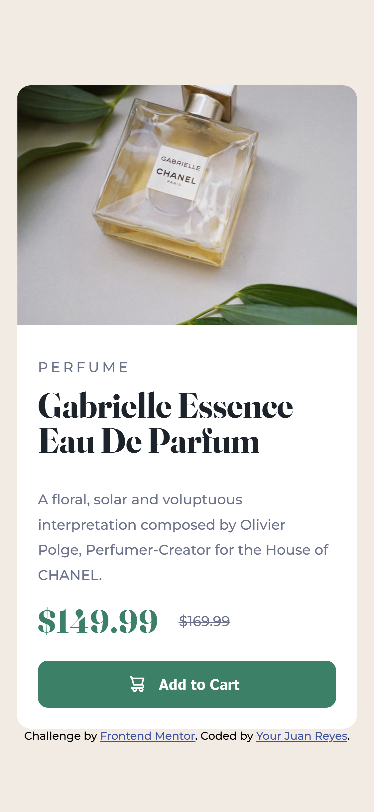
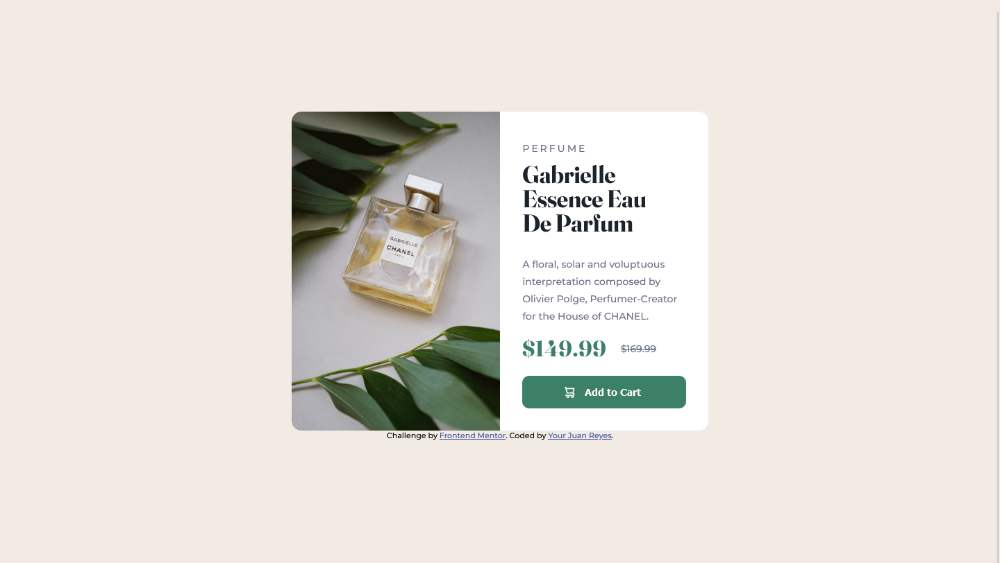

# Frontend Mentor - Product preview card component

## Deploying your project

As mentioned above, there are many ways to host your project for free. Our recommended hosts are:

- [GitHub Pages](https://pages.github.com/)
- [Vercel](https://vercel.com/)
- [Netlify](https://www.netlify.com/)

## Got feedback for us?

We love receiving feedback! We're always looking to improve our challenges and our platform. So if you have anything you'd like to mention, please email hi[at]frontendmentor[dot]io.

# Frontend Mentor - Product preview card component solution

## Table of contents

- [Overview](#overview)
  - [Screenshot](#screenshot)
  - [Links](#links)
- [My process](#my-process)
  - [Built with](#built-with)
  - [What I learned](#what-i-learned)
  - [Continued development](#continued-development)
- [Author](#author)
  
  
## Overview
Se trata de una card que a partir de un ancho determinado se desglosa en dos columnas.

En él tenemos una imagen, un título un párrafo, un precio y un botón de añadir al carrito.

### Screenshot

### Links

- Solution URL: [Add solution URL here](https://github.com/juan-mentor/product-preview-card-component-main.git)
- Live Site URL: [Add live site URL here](https://juan-mentor.github.io/product-preview-card-component-main/)

## My process

La verdad es que en este caso me ha ido mejor que en el anterior reto.

Parece ser que voy mejorando el protocolo de ecritura y estructura de mi proyecto. También ha ayudado que no hubieran tantos cambios de mobile a desktop.

### Built with

- Semantic HTML5 markup
- CSS custom properties
- Flexbox
- Mobile-first workflow

### What I learned

He aprendido que cuando a un contenedor, como por ejemplo un **div** le añades una imagen de fondo, esta no se vé hasta que das dimensiones en px al **div**. Sobre todo en lo que compete a su altura. Le puedo dar 100% al ancho y lo renderiza, pero 100% a la altura no hace caso y su altura es cero.

### Continued development

Me gustaría seguir profundizando en las imágenes de fondo y sus propiedades derivadas.

## Author

- Frontend Mentor - [@yourusername](https://www.frontendmentor.io/profile/juan-mentor)
